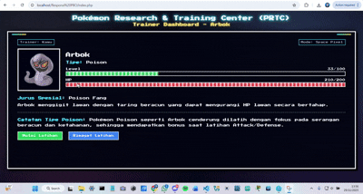

<!-- ========================================================= -->
<!--            P R T C   A R B O K   S I M U L A T O R        -->
<!-- ========================================================= -->

  
  <h1 align="center">🪐✨ PRTC – Arbok Training Simulator ✨🪐</h1>
  <h3 align="center">PHP Native • OOP • Pixel Space UI</h3>

  
  
  
  

---

## 👤 **Developer Information**

| Keterangan | Data |
|-----------|------|
| **Nama** | Muhammad Faizal Khabibi |
| **NIM** | H1H024003 |
| **Shift Awal** | A |
| **Shift Akhir** | D |

---

# 🎮 **Tentang Aplikasi**

**PRTC – Arbok Training Simulator** adalah aplikasi simulasi pelatihan Pokémon berbasis **PHP Native**, menggunakan 4 Pilar OOP:

- ✔ Encapsulation  
- ✔ Inheritance  
- ✔ Polymorphism  
- ✔ Abstraction  

Trainer dapat melatih Pokémon **Arbok (Poison Type)** melalui berbagai sesi latihan dan memonitor perkembangan:

- Level & HP naik sesuai jenis latihan  
- Jurus spesial aktif (Poison Fang)  
- Riwayat latihan otomatis tersimpan  

Aplikasi ini menggunakan tampilan **Pixel Art & Space Theme** untuk memberikan nuansa retro seperti game Pokémon GBA.

---

# 🎥 **Demo Aplikasi**

  

> *Demo ini menampilkan interaksi trainer dengan Arbok, peningkatan level, HP, dan tampilan UI pixel-space.*

---

# 🧱 **Struktur OOP**

Aplikasi ini menggunakan class sebagai berikut:

classes/
├── Pokemon.php # Abstract parent class
├── PoisonPokemon.php # Turunan untuk tipe Poison
├── Arbok.php # Pokémon utama
└── TrainingSession.php # Menyimpan riwayat latihan

### ✔ `Pokemon`  
Class abstract yang menjadi blueprint Pokémon dan memuat method dasar.

### ✔ `PoisonPokemon`  
Class abstract yang memberi efek bonus latihan khusus tipe Poison.

### ✔ `Arbok`  
Class konkret yang mengimplementasikan ability Arbok, specialMove(), dan rumus latihan.

### ✔ `TrainingSession`  
Mencatat detail latihan: jenis, intensitas, level before/after, HP before/after, dan timestamp.

---

# 🗂️ **Struktur Folder Project**

prtc_arbok/
├── assets/
│ ├── arbok.png
│ └── Arbok.gif
├── classes/
│ ├── Pokemon.php
│ ├── PoisonPokemon.php
│ ├── Arbok.php
│ └── TrainingSession.php
├── index.php
├── train.php
├── history.php
├── init.php
└── style.css

---

# 🌌 **Fitur Utama**

### 1️⃣ **Halaman Beranda**
- Menampilkan:
  - Nama Pokémon  
  - Tipe Pokémon  
  - HP & Level bar  
  - Jurus Spesial  
- Sprite Arbok HD

---

### 2️⃣ **Halaman Latihan Pokémon**
- Pilih jenis latihan:
  - Attack  
  - Defense  
  - Speed  
- Input intensitas latihan  
- HP & Level meningkat otomatis  
- Jurus spesial aktif  
- Data disimpan ke session  

---

### 3️⃣ **Riwayat Latihan**
- Semua sesi latihan tercatat:
  - Jenis latihan  
  - Intensitas  
  - Level sebelum/after  
  - HP sebelum/after  
  - Waktu latihan  
- Ditampilkan dalam table pixel-style

---

# 🚀 **Cara Menjalankan Aplikasi**

### ✔ **1. Download / Clone Project**

git clone https://github.com/faizalkhabibi/Muhammad-Faizal-Khabibi_H1H024003_ResponsiPBO25.git

### ✔ **2. Letakkan di folder server PHP**
Contoh:

**Laragon**

C:\laragon\www\prtc_arbok\

**XAMPP**

C:\xampp\htdocs\prtc_arbok\

---

### ✔ **3. Jalankan Server**

**XAMPP**
- Start Apache

**Laragon**
- Start All

**PHP Built-in**

php -S localhost:8000

---

### ✔ **4. Akses di Browser**

http://localhost/prtc_arbok/

---

# 🧪 **Teknologi yang Digunakan**

- PHP Native (tanpa framework)
- HTML + CSS custom
- Session PHP
- OOP Full Implementation
- CSS Pixel Neon Space Theme

---

# 🏁 **Penutup**

Project ini dikembangkan untuk memenuhi Responsi / Praktikum PBO dengan:

✔ OOP penuh  
✔ Tampilan UI profesional  
✔ Simulasi Pokémon Training  
✔ Penggunaan Session  
✔ Kode terstruktur & mudah dikembangkan  

---

  🎉 Terima kasih sudah melihat project ini!  
   
  Jangan lupa ⭐ star repository kalau bermanfaat 😊

